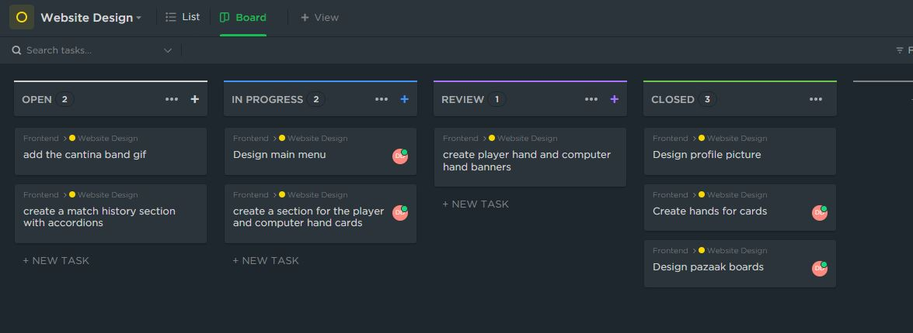
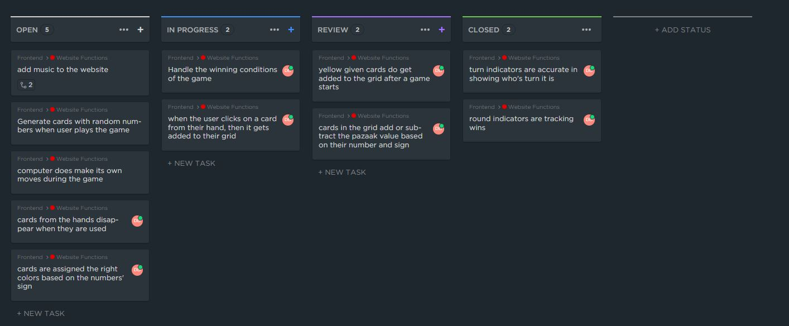
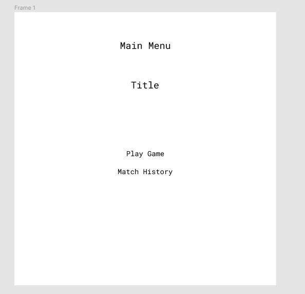
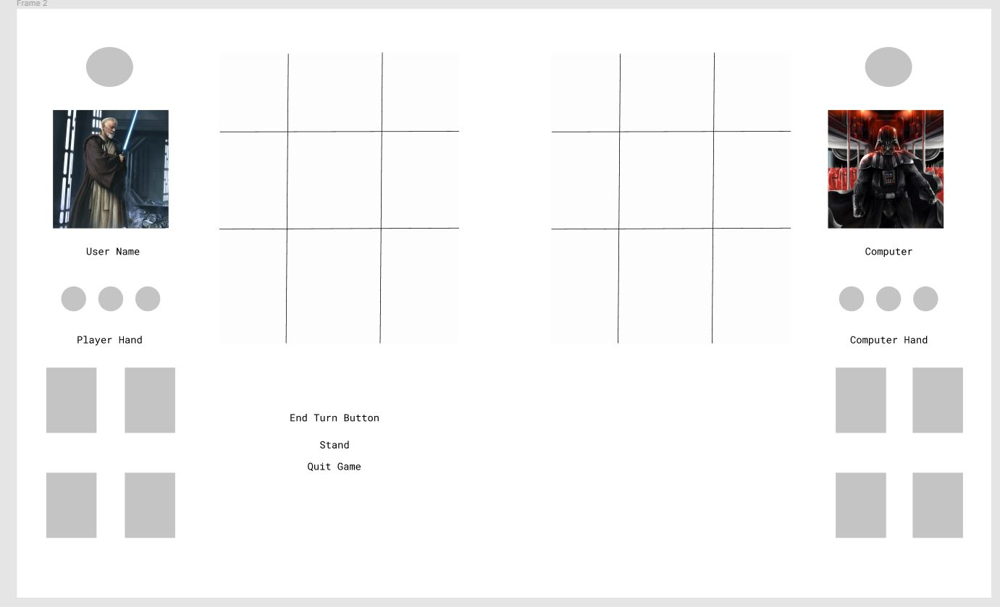

Project Description:

Pazaak - A card game from a game called Star Wars: Knights of the Old Republic. A popular card game that was played back in the Star Wars Old Republic era. The game is similar to blackjack but it has a twist where the player can manipulate their given number to achieve the winning number. The goal is to get closest to the number 20 or get exactly 20 without going over it. The player with the highest score less than or equal to 20 wins the round. Whoever wins three rounds within a match is the winner of the game.

## How I worked on this project

### ClickUp Kanban

### Wireframes

### User Stories

1. As a user, I can play a game against a computer.

Acceptance Criteria:

Given - The user want to play a pazaak game with a computer (Single player).
When - The user clicks on "play against computer" or "single player".
Then - the user chooses their side deck, enter the amount of points they want to bet, and begins the game when they are done which will generate the pazaak boards with the cards.

2. As a user, I can view my match history.

Acceptance Criteria:

Given - The user wants to know how many games they have played.
When - The user clicks on "View profile" to see all of their past matches.
Then - Their match history with the results, id, opponent, and date is returned in the "Match History" section of the website.

3. As a user, I can choose a profile picture for my account.

Acceptance Criteria:

Given - The user wants to set their profile picture.
When - The user goes into their "user settings" to edit their profile picture.
Then - When a profile picture is chosen, the user will be able to see that the profile picture has been changed.

4. As a user, I am required to make my side deck in order to play the game

Acceptance Criteria:

Given - The user is about to play a match of pazaak.
When - The user clicks on the "play against computer" or "single player" button.
Then - The user is prompted to customize their side deck before the game starts.

5. As a user, I can quit the game during a pazaak round.

Acceptance Criteria:

Given - The user wants to stop playing.
When - The user clicks on the "Quit Game" button.
Then - The user will be return to the main menu.

6. As a user, I am winning and losing with the right winning conditions.

Acceptance Criteria:

Given - The user is playing pazaak.
When - The user wins or loses.
Then - The user will gain a loss or win based on the correct winning condition.

7. As a user, I am able to stand in pazaak.

Acceptance Criteria:

Given - The user is playing pazaak.
When - The user decides to stand and does not want anymore cards.
Then - The user will stand until the computer stands or busts, and the winner is decided.

8. As a user, I am able to end my turn.

Acceptance Criteria:

Given - The user is playing pazaak.
When - The user decides to end their turn because they are done making their move.
Then - The game will end the user's turn, and then it will be the computer's turn.

9. As a user, I am able to put my positive or negative cards on my board.

Acceptance Criteria:

Given - The user is playing pazaak.
When - The user want to increase or decrease their pazaak value with their given cards.
Then - The user clicks on the card they want to use, and the card will decrease or increase the pazaak value depending on its sign and value.
